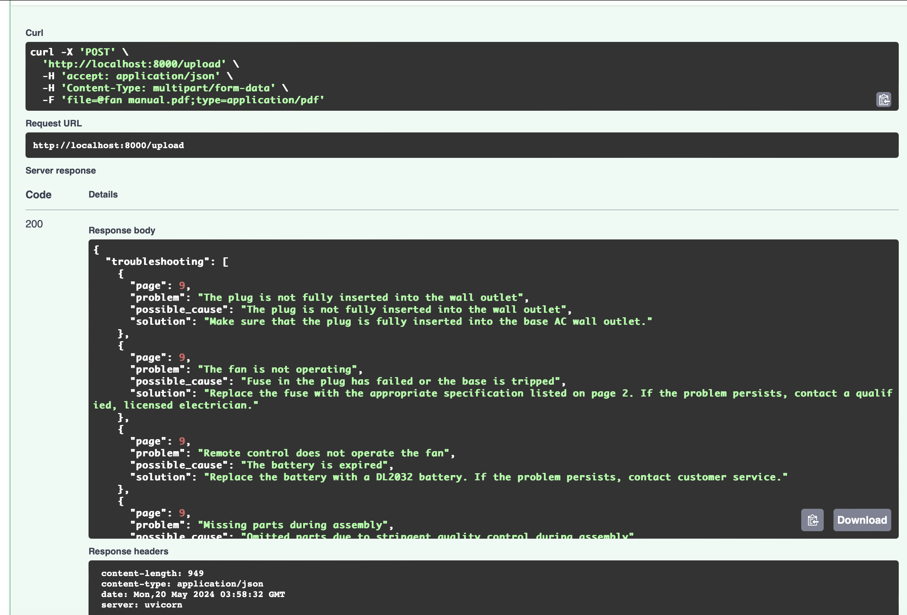

  # OCR FastAPI App

## Thoughts
- The troubleshooting information was always part of a table. I tried using various table extraction libraries but they were not successful given the nature of the image used in PDF.
- I tried greyscaling these images using tools like OpenCV2 and apply adaptive threshold to get clearer text.
- There can be some information missing from the JSON.

## How to Run the App

#Please update the openai API key in Dockerfile env.

To run this app, please clone this repo and run the `restart.sh` script if you are on macOS. This script takes care of cleanup and opens the web app if docker run was successful. Otherwise, please follow the commands below:

1. Build a Docker image:
    ```bash
    docker build -t ocr-fastapi-app .
    ```
   Make sure your Docker app is running in the background.

2. Once the image is built, execute:
    ```bash
    docker run -p 8000:8000 ocr-fastapi-app
    ```
   The FastAPI application will take some time to load and should be available at `localhost:8000/docs/`.

## Push OpenAI API Key to Docker Secret
You can push your OpenAI API key to Docker secret using the following command:
```bash
echo "your_openai_api_key" | docker secret create openai_api_key -
```
Alternatively you can use:
```bash
docker-compose up -d
```





